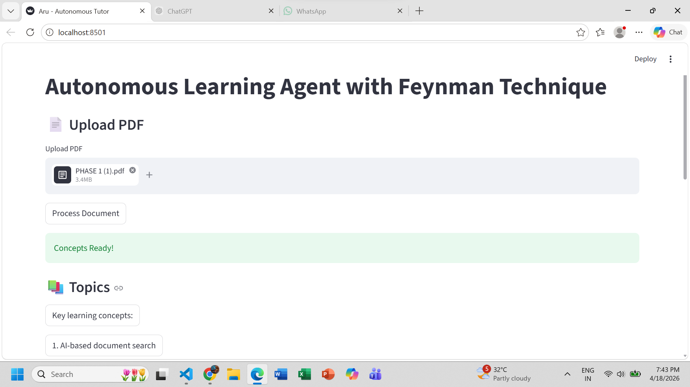
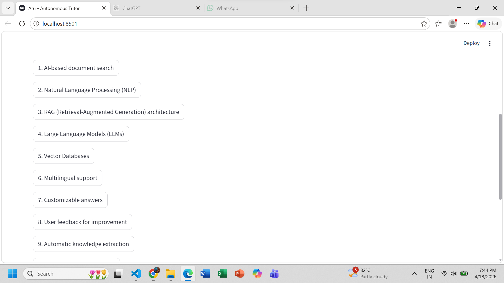
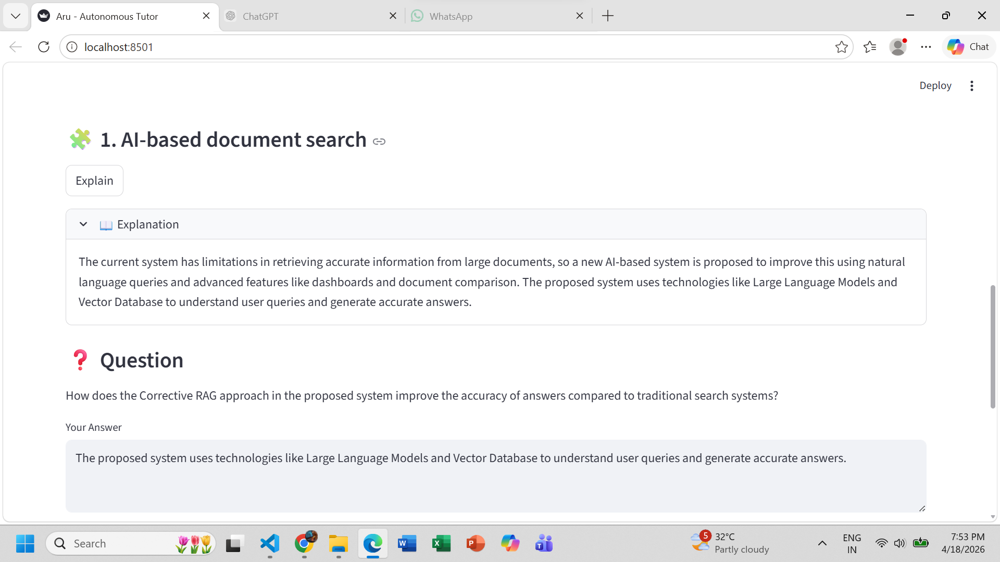
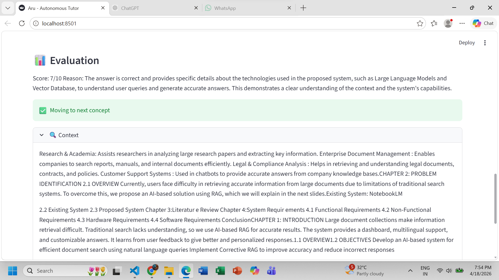
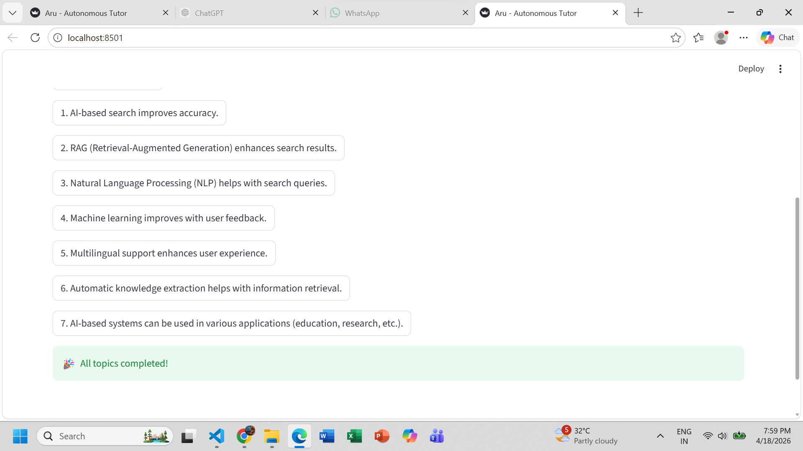
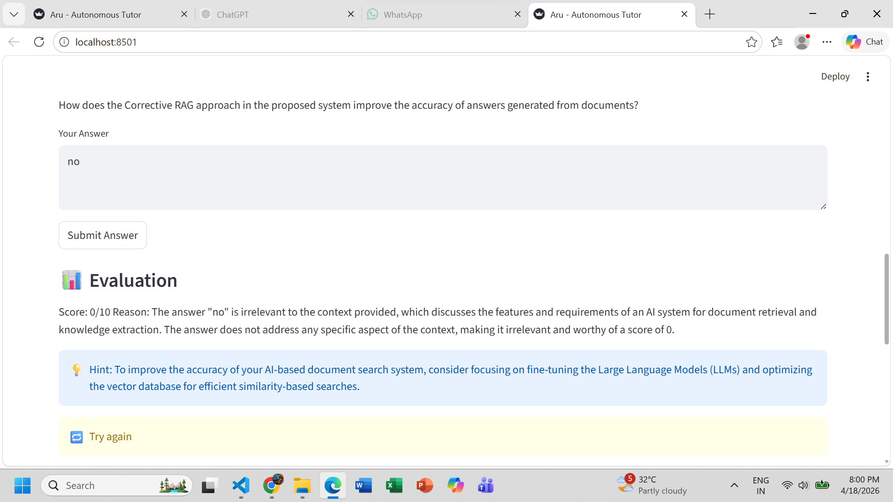
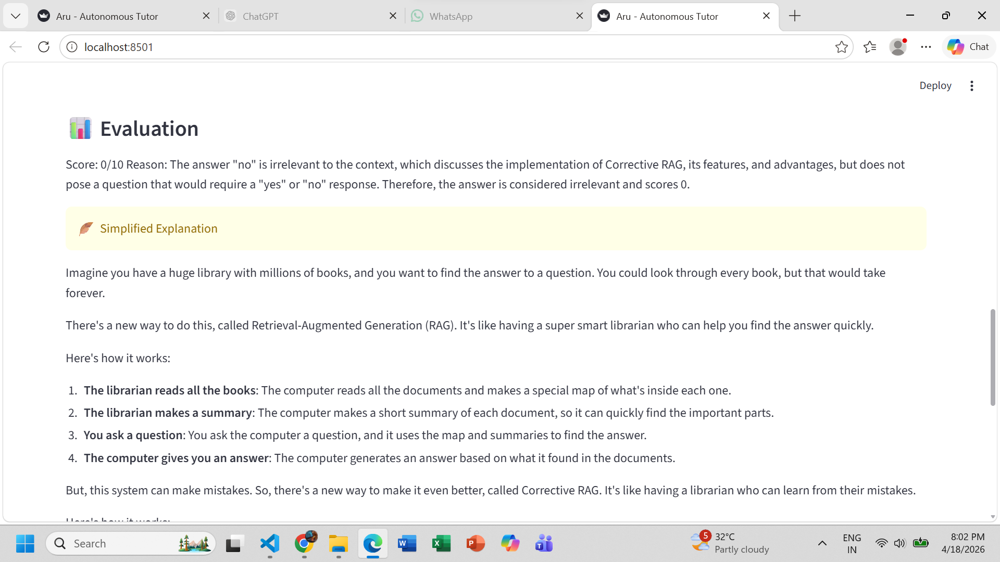
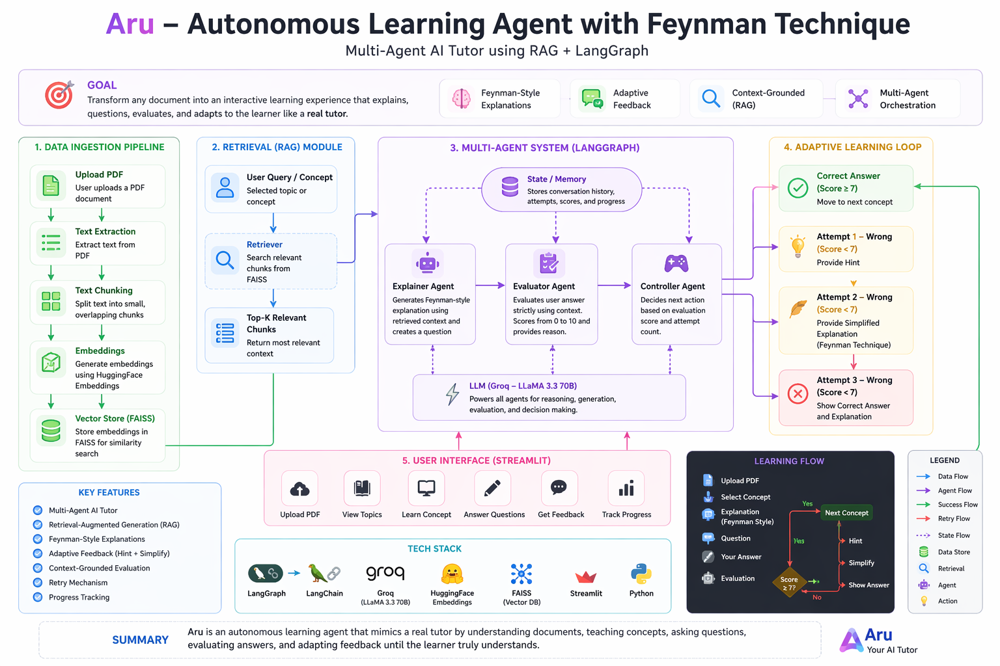

# 🧠 Aru – Autonomous Learning Agent with Feynman Technique

> Multi-Agent AI Tutor using RAG + LangGraph

---

## 🚀 Overview

Aru is an AI-powered autonomous learning system that transforms any PDF into an interactive tutor.  
It explains concepts, asks questions, evaluates answers, and adapts based on user performance.

---

## ❗ Problem Statement

Traditional learning from documents is passive:
- No interaction
- No feedback
- No adaptation to understanding

---

## 💡 Solution

Aru converts documents into an **adaptive AI tutor** by combining:
- Retrieval-Augmented Generation (RAG)
- Multi-agent orchestration
- Feynman-style explanations
- Feedback-driven learning loop

---

## 🏗️ System Architecture

### 1. Data Ingestion Pipeline
- Upload PDF  
- Extract text  
- Split into chunks  
- Generate embeddings  
- Store in FAISS  

---

### 2. Retrieval (RAG Module)
- User selects a concept  
- Retriever finds relevant chunks  
- Returns top-k context  

---

### 3. Multi-Agent System (LangGraph)

- **Explainer Agent**  
  Generates simple (Feynman-style) explanations and questions  

- **Evaluator Agent**  
  Evaluates answers using retrieved context  
  Gives score (0–10) and reasoning  

- **Controller Agent**  
  Decides next step based on performance  

- **State / Memory**  
  Tracks attempts, scores, and progress  

---

### 4. Adaptive Learning Loop

- ✅ Score ≥ 7 → Move to next concept  
- ❌ Attempt 1 → Give hint  
- ❌ Attempt 2 → Simplify explanation  
- ❌ Attempt 3 → Show correct answer  

---

## 🔁 Learning Flow

```
Upload PDF
↓
Extract Concepts
↓
Select Concept
↓
Explain (Feynman Style)
↓
Ask Question
↓
User Answer
↓
Evaluate (RAG)
↓
Adaptive Feedback (Hint / Simplify / Answer)
```

---

## 🔎 RAG Pipeline

1. Extract text from PDF  
2. Chunk the content  
3. Convert to embeddings (HuggingFace)  
4. Store in FAISS vector DB  
5. Retrieve relevant chunks  
6. Pass context to LLM  
7. Generate grounded response  

---

## ✨ Key Features

- Multi-Agent AI Tutor  
- Retrieval-Augmented Generation (RAG)  
- Feynman-style explanations  
- Context-grounded evaluation  
- Adaptive feedback system  
- Retry-based learning loop  
- Progress tracking  

---

## 📸 Screenshots

  
  
  
  
  
  
  

 


---

## 🛠️ Tech Stack

- Python  
- Streamlit  
- LangGraph  
- LangChain  
- FAISS  
- HuggingFace Embeddings  
- Groq (LLaMA 3.3 70B)  

---

## ⚙️ Installation

```bash
git clone https://github.com/your-username/aru-ai-tutor.git
cd aru-ai-tutor
pip install -r requirements.txt
```

---

## 🔐 Environment Setup

Create a `.env` file:

```
GROQ_API_KEY=your_api_key_here
```

---

## ▶️ Run the App

```bash
streamlit run app.py
```

---

## 🧠 How It Works (Interview Explanation)

- Converts PDFs into structured knowledge  
- Uses RAG to ensure answers are grounded in document context  
- Applies Feynman technique for better understanding  
- Uses multi-agent system for modular reasoning  
- Adapts learning based on user performance  

---

## ⚠️ Limitations

- Depends on quality of PDF  
- No image understanding  
- Latency from LLM responses  

---

## 🔮 Future Improvements

- Chat-style interface  
- Voice interaction  
- Personalized learning paths  
- Analytics dashboard  

---

## 📄 Resume Line

Built an autonomous AI tutor using RAG and multi-agent architecture that explains, evaluates, and adapts learning from PDFs.

---

## ⭐ Support

If you like this project, give it a star ⭐